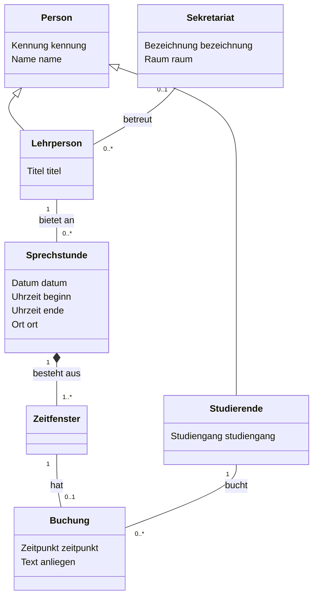

# Klassendiagramm nach Regeln — Terminplaner

```mermaid
classDiagram
    direction TB

    class Person {
        Kennung kennung
        Name name
    }

    class Lehrperson {
        Titel titel
    }

    class Studierende {
        Studiengang studiengang
    }

    class Sekretariat {
        Bezeichnung bezeichnung
        Raum raum
    }

    class Sprechstunde {
        Datum datum
        Uhrzeit beginn
        Uhrzeit ende
        Ort ort
    }

    class Zeitfenster {
    }

    class Buchung {
        Zeitpunkt zeitpunkt
        Text anliegen
    }

    Person <|-- Lehrperson
    Person <|-- Studierende

    Sekretariat "0..1" -- "0..*" Lehrperson : betreut
    Lehrperson "1" -- "0..*" Sprechstunde : bietet an
    Sprechstunde "1" *-- "1..*" Zeitfenster : besteht aus
    Zeitfenster "1" -- "0..1" Buchung : hat
    Studierende "1" -- "0..*" Buchung : bucht
```
