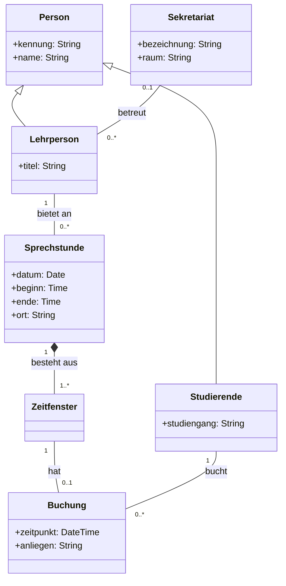

# Klassendiagramm — Terminplaner

```mermaid
classDiagram
    direction TB

    class Person {
        +kennung: String
        +name: String
    }

    class Lehrperson {
        +titel: String
    }

    class Studierende {
        +studiengang: String
    }

    class Sekretariat {
        +bezeichnung: String
        +raum: String
    }

    class Sprechstunde {
        +datum: Date
        +beginn: Time
        +ende: Time
        +ort: String
    }

    class Zeitfenster {
    }

    class Buchung {
        +zeitpunkt: DateTime
        +anliegen: String
    }

    Person <|-- Lehrperson
    Person <|-- Studierende

    Sekretariat "0..1" -- "0..*" Lehrperson : betreut
    Lehrperson "1" -- "0..*" Sprechstunde : bietet an
    Sprechstunde "1" *-- "1..*" Zeitfenster : besteht aus
    Zeitfenster "1" -- "0..1" Buchung : hat
    Studierende "1" -- "0..*" Buchung : bucht
```
