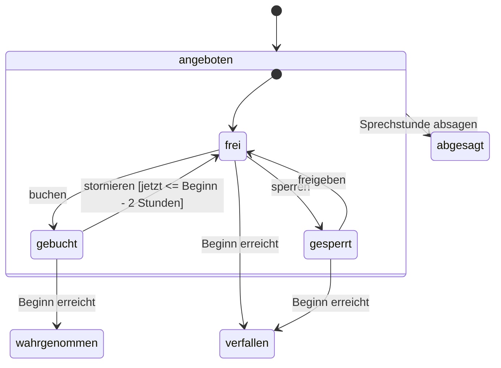

```mermaid
stateDiagram-v2
    [*] --> angeboten

    state angeboten {
        [*] --> frei
        frei --> gebucht : buchen
        gebucht --> frei : stornieren [jetzt <= Beginn - 2 Stunden]
        frei --> gesperrt : sperren
        gesperrt --> frei : freigeben
    }

    gebucht --> wahrgenommen : Beginn erreicht
    frei --> verfallen : Beginn erreicht
    gesperrt --> verfallen : Beginn erreicht
    angeboten --> abgesagt : Sprechstunde absagen
```