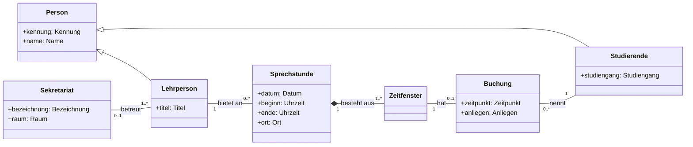

# Klassendiagramm nach meinen Regeln

```mermaid
classDiagram
    direction LR

    class Person {
        +kennung: Kennung
        +name: Name
    }

    class Lehrperson {
        +titel: Titel
    }

    class Studierende {
        +studiengang: Studiengang
    }

    class Sprechstunde {
        +datum: Datum
        +beginn: Uhrzeit
        +ende: Uhrzeit
        +ort: Ort
    }

    class Zeitfenster

    class Buchung {
        +zeitpunkt: Zeitpunkt
        +anliegen: Anliegen
    }

    class Sekretariat {
        +bezeichnung: Bezeichnung
        +raum: Raum
    }

    Person <|-- Lehrperson
    Person <|-- Studierende

    Lehrperson "1" -- "0..*" Sprechstunde : bietet an
    Sprechstunde "1" *-- "1..*" Zeitfenster : besteht aus
    Zeitfenster "1" -- "0..1" Buchung : hat
    Buchung "0..*" -- "1" Studierende : nennt
    Sekretariat "0..1" -- "1..*" Lehrperson : betreut
```
