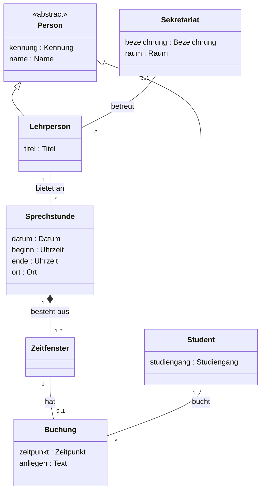

# Klassendiagramm — Beschreibung 3 (Daten des Terminplaners)

```mermaid
classDiagram
    class Person {
        <<abstract>>
        kennung : Kennung
        name : Name
    }
    class Lehrperson {
        titel : Titel
    }
    class Student {
        studiengang : Studiengang
    }
    class Sprechstunde {
        datum : Datum
        beginn : Uhrzeit
        ende : Uhrzeit
        ort : Ort
    }
    class Zeitfenster
    class Buchung {
        zeitpunkt : Zeitpunkt
        anliegen : Text
    }
    class Sekretariat {
        bezeichnung : Bezeichnung
        raum : Raum
    }

    Person <|-- Lehrperson
    Person <|-- Student
    Lehrperson "1" -- "*" Sprechstunde : bietet an
    Sprechstunde "1" *-- "1..*" Zeitfenster : besteht aus
    Zeitfenster "1" -- "0..1" Buchung : hat
    Student "1" -- "*" Buchung : bucht
    Sekretariat "0..1" -- "1..*" Lehrperson : betreut
```
