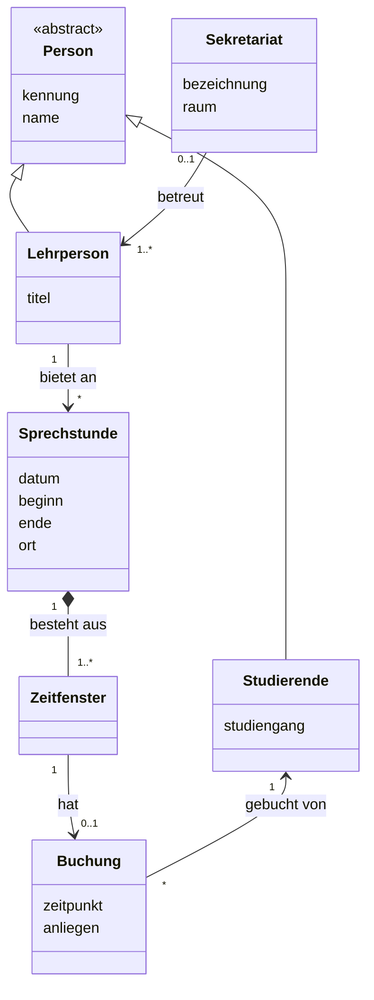

# Klassendiagramm — Terminplaner für die THM

Grundlage: Beschreibung 3 in `ue06/fall.md`.

```mermaid
classDiagram
    class Person {
        <<abstract>>
        kennung
        name
    }
    class Lehrperson {
        titel
    }
    class Studierende {
        studiengang
    }
    class Sekretariat {
        bezeichnung
        raum
    }
    class Sprechstunde {
        datum
        beginn
        ende
        ort
    }
    class Zeitfenster
    class Buchung {
        zeitpunkt
        anliegen
    }

    Person <|-- Lehrperson
    Person <|-- Studierende
    Lehrperson "1" --> "*" Sprechstunde : bietet an
    Sprechstunde "1" *-- "1..*" Zeitfenster : besteht aus
    Zeitfenster "1" --> "0..1" Buchung : hat
    Studierende "1" <-- "*" Buchung : gebucht von
    Sekretariat "0..1" --> "1..*" Lehrperson : betreut
```
