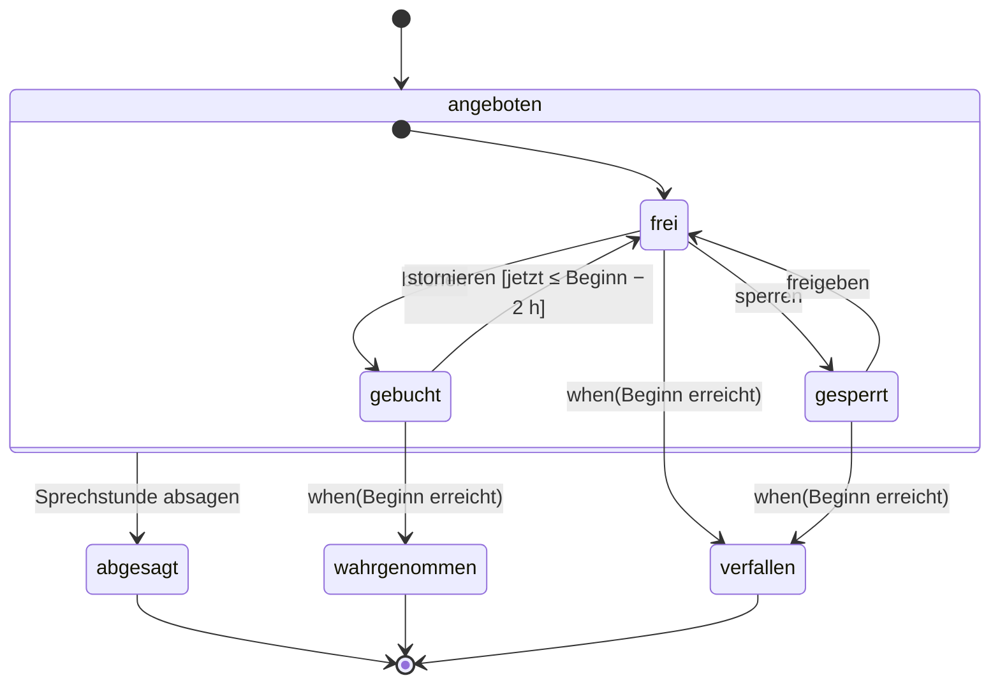

# Zustandsdiagramm eines Zeitfensters

Nach Beschreibung 4 in `ue06/fall.md`, ohne Agenten geschrieben.

```mermaid
stateDiagram-v2
    [*] --> angeboten
    state angeboten {
        [*] --> frei
        frei --> gebucht : buchen
        gebucht --> frei : stornieren [jetzt ≤ Beginn − 2 h]
        frei --> gesperrt : sperren
        gesperrt --> frei : freigeben
    }
    angeboten --> abgesagt : Sprechstunde absagen
    gebucht --> wahrgenommen : when(Beginn erreicht)
    frei --> verfallen : when(Beginn erreicht)
    gesperrt --> verfallen : when(Beginn erreicht)
    abgesagt --> [*]
    wahrgenommen --> [*]
    verfallen --> [*]
```
